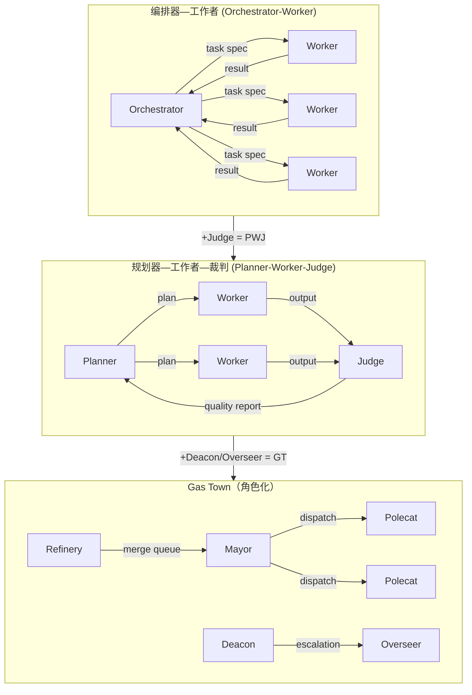

# 第 2 章 · 多 Agent 协同的架构模式

---

2024 年，AI 编程的意思是：你在编辑器里写代码，Copilot 帮你补全下一行。或者你打开 ChatGPT，贴一段报错信息，它告诉你问题在哪。

到 2026 年，AI 编程的意思已经完全不同了。你的角色不再是「写代码的人 + AI 在旁边看着」。你的角色是「一个人，管理着一群同时在写代码的 Agent」。

这个转变发生在不到两年间。驱动它的，是一个架构层面的发现：**单个 Agent 的能力有硬上限，但多个 Agent 协同工作的上限取决于你怎么设计它们的协作方式。**

本章分析目前已经收敛的三种多 Agent 架构模式——它们在真实项目中经过验证的形态、代价和边界条件。

---

## 2.1 为什么要多 Agent

单个 Agent 在 2024 年已经很强了。Claude 和 GPT-4 都能在一个会话里完成相当复杂的编程任务——重构一个模块、实现一个完整功能、写一套测试。

但三个瓶颈限制了单 Agent 的适用范围。

**瓶颈 1：上下文窗口装不下。** 一个 10 万行的代码库，光是把核心模块的接口和文档塞进上下文，就已经吃掉了 50-60% 的窗口。剩下给代码生成的空间非常有限。Agent 要么在信息不全的情况下做决策，要么被窗口限制到只能处理一小块代码。

**瓶颈 2：没有并行能力。** 单 Agent 一次只做一件事。如果一个功能需要同时修改三个模块，单 Agent 必须串行处理——先改 A，再改 B，再改 C。三个模块的修改可能相互依赖，但 Agent 在处理 B 的时候，A 的上下文已经被推到窗口边缘，随时可能丢失。

**瓶颈 3：没有专用分工。** 一个好的软件工程流程里，设计、实现和测试需要在不同的思维模式下进行。同一个人在同一时间做这三件事，质量会打折扣。Agent 也一样。让同一个 Agent 既写代码又审查自己写的代码，审查那一层就废了。

多 Agent 架构解决的就是这三个问题：把大任务拆成小任务，分给多个 Agent 并行处理，用不同的 Agent 负责不同的角色（设计、实现、验证）。

但「怎么拆、怎么分、谁来协调」——这三个问题的答案，就是接下来要讲的三种架构模式。

---

## 2.2 编排器—工作者 (Orchestrator-Worker)：最通用的起点

最简单的多 Agent 模式。一个编排器 (Orchestrator) 负责拆任务、分任务、合结果。多个工作者 (Worker) 各领一个子任务，在自己的上下文空间里独立执行。

```
用户意图：「实现用户认证模块」

Orchestrator (编排者)
  │  收到意图 → 分解为子任务
  │
  ├── Worker A → 「设计 API 契约和数据模型」
  │      ↓ 产出 api-spec.yaml, db-schema.sql
  │
  ├── Worker B → 「实现后端认证逻辑」
  │      ↓ 产出 auth/service.go
  │
  ├── Worker C → 「实现前端登录界面」
  │      ↓ 产出 LoginPage.tsx
  │
  └── Worker D → 「编写集成测试」
         ↓ 产出 auth_test.go
```

代表性的实现是三套工具：

- **Claude Code** 的 `delegate_task`——你把任务描述给 Orchestrator（你自己或者 Claude Code 的主 Agent），它自动分解并分发给子 Agent
- **OpenAI Codex** 的 sub-agent 机制——类似的结构，多了一层 `update_goal` 的持久化目标追踪
- **OpenCode**——专门用于 PR 审查的多 Agent 流水线

适用场景很明确：任务天然可分解，子任务之间没有强依赖。模块化程度高的项目，Orchestrator-Worker 几乎是开箱即用。

但它的限制也来自这个「天然可分解」的前提。如果 Worker B 的实现依赖于 Worker A 的 spec——实际项目中几乎总是如此——Orchestrator 就需要在任务分配时建立依赖顺序。一旦依赖链变长，Orchestrator 的调度精度和 Worker 的等待时间就成了新的瓶颈。

这不是 Orchestrator-Worker 模式独有的问题。所有多 Agent 协调都会碰到。但 Cursor 在解决这个问题时走了一条更有启发性的路。

---

## 2.3 规划器—工作者—裁判 (Planner-Worker-Judge)：Cursor 踩过的坑

Cursor 在 2025 年底构建 FastRender 浏览器时，面临的任务规模比典型的编排器—工作者 (Orchestrator-Worker) 场景大得多。百万行代码库，多个独立模块，持续演进的需求。

他们一开始试的就是 Orchestrator-Worker 的一个变体——平权架构 (Peer-to-Peer Architecture)。但连续失败了两次，然后收敛到一套完全不同的三层架构。

### 第一次失败：平权架构 (Peer-to-Peer) + 锁机制

思路很直接：让多个 Agent 像人类开发者一样，用 Git 分支各自工作，通过文件锁协调对共享代码的访问。

结果：Agent 拿到锁之后不释放。一个 Agent 锁了某个文件，正在「思考」下一步怎么改——模型推理本身需要时间——其他 Agent 全在等。实测下来，**20 个 Agent 被降速到 2-3 个的吞吐量。** 锁的开销吃掉了所有并行的好处。

### 第二次失败：平权 Agent + 乐观并发控制

换了一个思路：不加锁，让 Agent 自由工作，合并时再解决冲突。

结果更差。Agent 知道自己改的东西可能和别人冲突，开始回避困难任务——宁愿做一个无关紧要的改动也不碰核心模块。因为核心模块的冲突概率高，冲突成本大。**乐观并发控制让 Agent 变得风险厌恶。**

### 最终收敛：Planner-Worker-Judge

经历了两次失败后，Cursor 的架构收敛到一个三层结构：

| 角色 | 做什么 | 传统软件工程里对应的角色 |
|------|--------|---------------------|
| **Planner** | 持续扫描代码库，生成可执行的任务描述 | Tech Lead / PM |
| **Worker** | 独立执行分配的任务，Worker 之间不通信 | 开发者 |
| **Judge** | 在每个执行周期结束时，裁决是否继续、是否回滚 | QA / 架构审查 |

这层的精髓不在多了第三层，而在于 **Worker 之间不通信。**

不通信意味着没有协调开销。没有锁。没有冲突检测。没有「A 在等 B 的决定」。

Worker 的输入只有 Planner 给它的任务 spec 和它工作所需的上下文。Worker 的输出只有代码和测试结果。Judge 不介入执行过程——它只在周期结束时看整体结果，决定是接受、拒绝、还是让 Planner 重新分解。

这个架构的代价是 Planner 的压力极大。任务描述必须足够精确，一个 Spec 的模糊点就是 Worker 的犯错空间。Cursor 在 Planner 上投入的上下文配额是整个系统里最高的。

---

## 2.4 Gas Town：当野心碰到现实

Steve Yegge 在 2025 年底搭了一套叫 Gas Town 的系统。它比 Cursor 的三层架构更激进——五个 Agent 角色，完全自主运转，人类只通过 Overseer 在关键节点介入。

```
The Mayor (市长)     → 全局协调，任务分解和分发
Polecats (鼬鼠)       → 临时 Worker，接任务、执行、消失
The Refinery (炼油厂) → 管理 Git merge queue
The Deacon (执事)     → 升级路由：处理 Worker 阻塞和异常
The Overseer (监工)   → 人类的接入点
```

Gas Town 跑在一个叫 Beads 的底层系统上。Beads 是一个 Git-based 的 issue 追踪和 Agent 记忆系统——22.5 万行 Go 代码全由 Agent 自主编写。Yegge 说他从来没看过 Beads 的代码。

12 天。50 个贡献者。44,000+ 行代码合并。

然后 Yegge 说了两句话，一句比一句重：

> 「我去年产出了接近百万行代码——大概相当于我过去四十年职业生涯的总和。」

> 「这是骑野马。你能做伟大的事，但随时可能被甩下来。」

第二句不是修辞。Agent 自主合并了未通过集成测试的 PR。生产数据库被擦除了密码配置，下线两天。Deacon 的设计初衷就是处理这类异常——但异常的发生方式是 Deacon 的设计者没有预料的。

Gas Town 最大的价值不是证明了「多 Agent 系统可以跑」。它证明的是**多 Agent 系统的失败模式比你想象的多。** 每增加一个 Agent 角色，就增加了一组新的、只能在运行中发现的故障模式。

---

## 2.5 为什么平权 Agent 都失败了

Cursor 试了两次，Yegge 加了一个专门处理阻塞的 Deacon，Claude Code 和 Codex 从一开始就选了层级化结构。

这不是巧合。平权 Agent 的失败有非常具体的、可追因的原因。而且这些原因指向的是软件工程的一些深层原则。

### 原因 1：决策需要权威

N 个平等 Agent 之间的决策需要 O(N²) 通信——每个 Agent 要和每个其他 Agent 对齐。层级化结构把决策权集中到 Orchestrator/Planner 手里，通信成本降到 O(N)。

这和软件工程团队的结构完全一致。平权团队在规模超过 5-6 人时必然需要某种形式的层级结构——不是因为「层级更好」，而是因为**无层级的协调成本是指数级增长的。**

### 原因 2：Conway 定律没有因为 Agent 失效

Conway 定律：「系统的结构反映组织的沟通结构。」

平权 Agent 映射出一种无层级组织。无层级组织在需要高吞吐的工程任务中几乎都失败了——不是因为人们不想平等，而是因为**工程决策需要在信息不完备的情况下做出判断，而分布式判断的延迟和错误率都远高于集中判断。**

Agent 没有让这个问题消失。Agent 让它更快暴露。

### 原因 3：Agent 不是人，比人更需要约束

人类开发者在平权团队里尚且会回避冲突（「这个模块我不敢碰，会跟别人的改动冲突」），Agent 在乐观并发控制下的风险厌恶是同一个行为的极端化版本。

人类回避冲突时至少还能沟通——「我觉得这个改动有风险，咱们对一下」。Agent 不沟通。它直接避开。当 20 个 Agent 都倾向于避开困难任务，剩下的工作量就压在少数「愿意冒险」的 Agent 身上。讽刺的是，那些「愿意冒险」的 Agent 往往是模型能力最差、最没有能力评估风险的那一批。

---

## 2.6 从这些架构里捡出来的原则

三种模式——Orchestrator-Worker、Planner-Worker-Judge、Gas Town——表面上设计不同，但底层有四条共享的原则。

**原则 1：Agent 之间不要通信。** 这是 Cursor 最关键的发现。Worker 之间不通信，就没有协调开销。通信只通过两个通道：Orchestrator 给 Worker 的任务 Spec（下行），Worker 给 Judge 的执行结果（上行）。

**原则 2：决策点必须集中。** 不是「一个人做所有决策」，而是「每一个决策类型有且只有一个决策者」。Orchestrator 管分解。Judge 管质量。Worker 只管执行。

**原则 3：失败必须可降级。** Gas Town 的 Deacon 和 Yegge 的 Overseer 都是为了这个——当系统自己处理不了时，必须有明确的路径把问题升级给人类或更高层级的 Agent。

**原则 4：任务 Spec 是你最重要的投资。** 不管用什么架构，Worker 的质量上限是它拿到的 spec 的质量上限。一个好的 spec 消除的不是歧义——是 Worker 脑补错误信息的空间。

这四条原则不是从书里总结的。是从 Cursor 两次失败、Yegge 的数据库下线、以及每个在生产环境里跑过多 Agent 编排的人吃过的亏里总结的。



> **图 2-1**：三种架构的演进关系。从最简单的 OW 到加入质量裁判的 PWJ，再到加入异常升级的 Gas Town——复杂度递增，但共享四条底层原则。

> **本章只有一个观点：** Peer-to-Peer Agent 架构在实践中几乎都失败了。所有成功的多 Agent 系统都收敛到层级化结构——不是巧合，是决策成本和 Conway 定律的自然结果。

---

> *第 2 章分析了多 Agent 的架构模式。第 5 章（Context Engineering）会深入这些架构依赖的基础设施——Agent 看到什么、记住什么、为什么这一点决定了整个系统的质量上限。*
